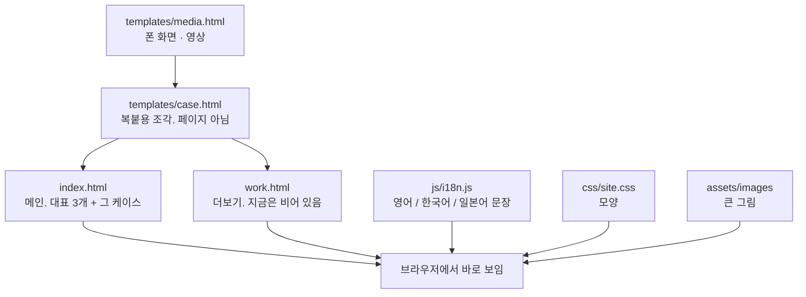
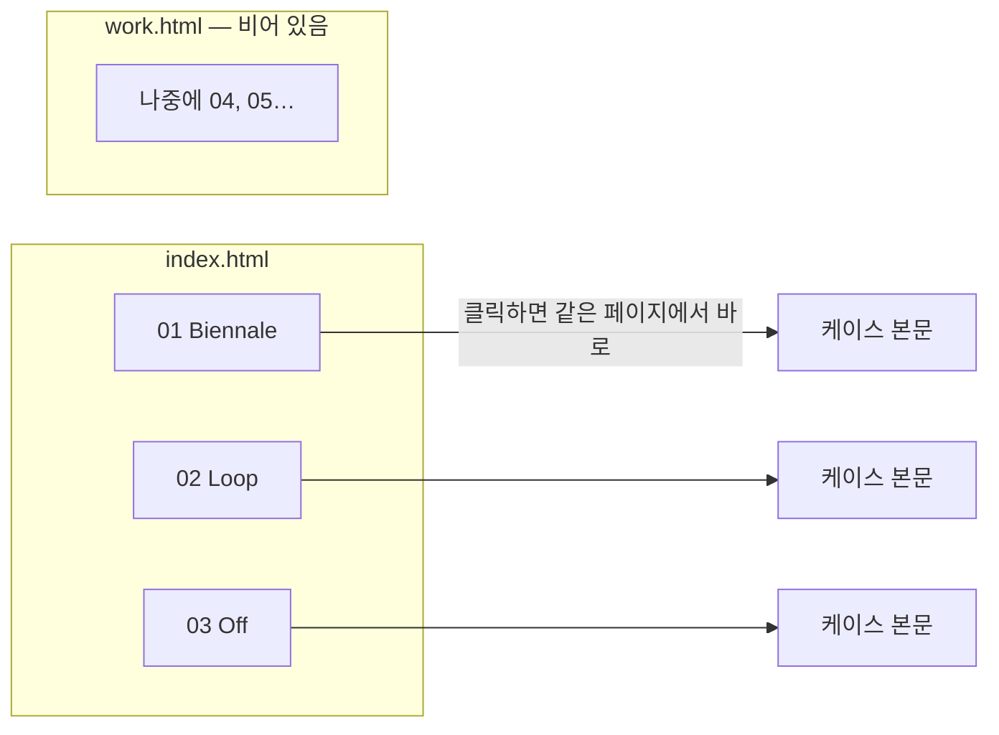
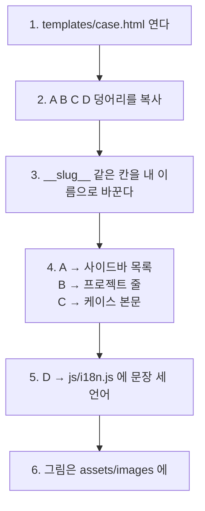

# 이 사이트는 어떻게 관리하나요

코드를 몰라도 됩니다. **파일을 열고, 복사하고, 붙이면** 됩니다.

지금 방식은 이렇습니다.

- 메인은 **대표 3개만** 보여 줍니다.
- 그 3개는 `index.html` 안에 본문이 들어 있어서, 클릭하면 **바로** 열립니다. (나중에 불러오지 않습니다.)
- `work.html` 은 더보기 페이지입니다. **지금은 비어 있습니다.** 4번째부터는 나중에 여기 붙입니다.

---

## 파일이 하는 일

| 파일 | 언제 여나요 |
|---|---|
| `index.html` | 메인에 보이는 01·02·03, 소개, 연락 |
| `work.html` | 4번째 이후. 지금은 손대지 않아도 됨 |
| `templates/case.html` | **새 프로젝트를 넣을 때 여기만 복사** |
| `templates/media.html` | 폰 화면 · 영상. 필요할 때 케이스에 붙임 |
| `js/i18n.js` | 문장을 세 언어로 쓸 때 |
| `css/site.css` | 색, 크기, 여백 |
| `assets/images/` | 커버 그림 |
| `assets/video/` | 나중에 넣는 mp4 |

---

## 화면이 열리는 길

핵심: **보고 싶은 글이 그 HTML 파일 안에 있어야** 바로 열립니다.

---

## 새 프로젝트 하나 넣는 순서

대표 3개 다음에 넣을 거면 `work.html` 에 붙입니다.  
메인 3개를 바꿀 거면 `index.html` 에 붙입니다.

`templates/case.html` 맨 위에 토큰 설명이 있습니다.  
예: `__slug__` → `park` , `__title__` → 프로젝트 이름.

---

## 폰 화면 · 영상

지금은 01–03에 안 붙어 있습니다. 나중에 넣을 때 `templates/media.html` 을 엽니다.

- **폰 UI** (캡처, 화면 녹화) → PHONE
- **와이드 영상** → VIDEO (`cv-fig` 대신)
- 파일은 `assets/video/` 에 mp4, 포스터는 `assets/images/`

---

## 하지 않아도 되는 것

- `package.json` 같은 건 이 사이트에 없습니다. 설치할 것 없음.
- 새 페이지를 처음부터 만들 필요 없음. 템플릿을 붙이면 됩니다.
- 한국어·일본어는 **UTF-8** 로만 저장하세요. 다른 방식으로 저장하면 글자가 깨집니다.
